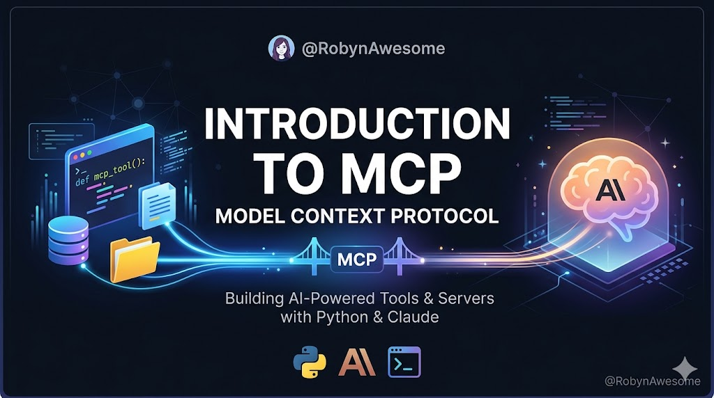

<div align="center">
  
  
  <h1>Introduction to MCP</h1>
  
  <p><strong>Multi-LLM Model Context Protocol (MCP) Servers & Clients</strong></p>

  <!-- LLM Badges -->
  <p>
    <a href="https://claude.ai">
      
    </a>
    <a href="https://grok.x.ai">
      
    </a>
    <a href="https://gemini.google.com">
      
    </a>
    <a href="https://github.com/features/copilot">
      
    </a>
  </p>

  <!-- Core Tech Badges -->
  <p>
    <a href="https://www.python.org">
      
    </a>
    <a href="https://github.com/astral-sh/uv">
      
    </a>
    <a href="https://anthropic.com">
      
    </a>
  </p>

  <a href="https://github.com/RobynAwesome/Introduction-to-MCP/stargazers">
    
  </a>
</div>

<br>

## 👋 About the Project
  <p>
    <a href="https://safeskill.dev/scan/robynawesome-introduction-to-mcp">
      
    </a>
  </p>

This repository is a **practical introduction** to **Anthropic’s Model Context Protocol (MCP)** with **full multi-LLM support**.

It demonstrates building MCP servers and clients while using:
- **Claude** (native Anthropic SDK)
- **Grok** (xAI)
- **Gemini** (Google)
- **Copilot** (GitHub)

The `orch/` layer uses all four LLMs together to **train and improve orchestration logic**.

---

## 🛠️ Tech Stack

<div align="center">
  
</div>

---

## ✨ Features

- ⚡ Full MCP server + client implementation  
- 🌐 Multi-LLM support (Claude • Grok • Gemini • Copilot)  
- 🚀 `orch/` layer trained with all four LLMs  
- 🧪 Ultra-modern Python setup with `uv`  
- 📁 Clean, well-documented structure  
- 🔧 Ready to run in minutes  
- 🇿🇦 Built in South Africa

---

📊 MCP Architecture


👩‍💻 About Me
Kholofelo Robyn Rababalela
Freelance Web Developer · Computer Engineering Student
📍 Cape Town, Western Cape, South Africa

🔗 Connect With Me

LinkedIn
Ko-fi (Support my open-source work)
PayPal


Made with ❤️ in South Africa 🇿🇦
Star ⭐ this repo if you found it useful!

---

## ORCH Apprenticeship Training Loop

The diagram below shows how ORCH (the apprentice AI student) interacts with mentor agents (Claude, Gemini, Grok, Copilot) through MCP orchestration, while maintaining transparent audit logs of reasoning and execution.


---

## 🚀 Quick Start

```bash
# 1. Clone the repo
git clone https://github.com/RobynAwesome/Introduction-to-MCP.git
cd Introduction-to-MCP

# 2. Install dependencies with uv
uv pip install -e .

# 3. Activate the virtual environment (Windows)
.\.CLI_Project\Scripts\activate
# or if using the default venv:
# .\.venv\Scripts\activate

# 4. Run the example
python main.py
