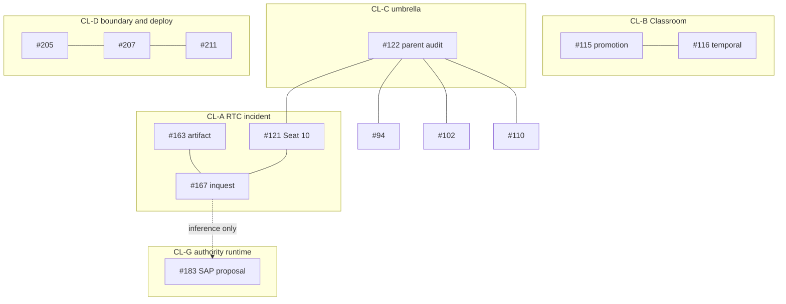

# ISSUE RECONCILIATION LEDGER - 2026-09-30 (WAVE 0 - CONTEXT ANCHOR)

**Status:** ACTIVE RECEIPT / OBSERVATION ONLY. This receipt changes no issue state, repository setting, dependency, or runtime.
**Receipt id:** `ILR-2026-09-30` · **Machine twin:** `ISSUE_RECONCILIATION_LEDGER_2026-09-30.json` (append-only, hash-chained)
**Authority:** Robyn, 2026-09-30 22:14 UTC: "YOU MAY BEGIN EXCTION OF YOUR PLAN I APPROVE" (E1). The Forge CA brief "GSMB continuity and admission brief", relayed in the same thread, is an attributed instruction.
**Actor:** Cursor cloud agent, stateless renter, operational rank Chief Facilitator (CF). **Model:** Claude Sonnet 5.5 as stated in this session's system prompt; Forge's brief names Fable. Both are recorded and not reconciled here (a model name in a receipt is attribution, not attestation). **Interface:** Cursor cloud agent, Linux VM, GitHub App token `cursor`.
**Base:** `master@8c6d22f22dbc600a38b52daf3b2887940b8841fb` (observation began at `65975a12`; master advanced when PR #237 was merged under the owner's identity during the session, see O-01 and O-20) · **Observation window:** live reads 2026-09-30T22:15Z to 2026-09-30T23:23Z; inputs from earlier in the session are dated where used (issue dump 21:36Z, PR #236 merge 21:05:03Z) · **Publishing worktree:** clean checkout of the base, branch `cursor/issue-ledger-context-anchor-4e71`.
**GSMB tier:** Cloud (this file, once merged). Local GSMB: UNKNOWN to this runtime. Google Drive GSMB: UNKNOWN until an owner receipt exists.
**Doctrine:** `I_AM_STATELESS_RENTER_NOT_LANDLORD` · `CLEAR_PASS != POC_VALIDATED` · `WRITTEN_INSTRUCTION != RUNTIME_ENFORCEMENT`

> **Added 2026-10-01T08:29:00Z. This file is not deleted.** Claim `C-121-1` in section 7 stays. Entry `ILR-2026-09-30-E012` stays. Master Robyn: Seat 10 stays occupied by ANTIGRAVITY as Lead Developer. Section 19 names who wrote the suspension sentence. No earlier row is edited.

---

## 0. Read this first: where the evidence changed the plan

The approved plan was checked against live GitHub and master before any claim was written. These findings changed verdicts. Details are in section 5.

1. **F-1** The approving-review requirement is not observably in force (recurrence).
2. **F-2** Protected-material flag: tracked Structure/discord_backup_codes.txt in a public repository.
3. **F-3** #207 is not ready to close; owner-closeable set is #205 only.
4. **F-4** #163 artifact is delivered but its own status is OPEN with no exit criteria.
5. **F-5** #183's link to #121/#167 is an inference, and its acronym collides.
6. **F-6** #211 HOLD persists after the latest merge.
7. **F-7** #158's pull request is stale and its direction may be superseded.
8. **F-8** #122's cited receipt is absent and it is the declared parent audit of eight issues.
9. **F-9** #167 question 3 was open when PR #166 merged.
10. **F-10** Third-party and generated material dominates the tracked tree.

Consequence for the plan: the owner-closeable set shrinks from four issues (#205, #207, #163, #122) to one (#205). Each other issue stays open with a named next action and actor.

---

## 1. Working authority and role packet

```text
Robyn - final human authority
  -> RTC - governed deliberation and admission
    -> Forge / CA - architecture, integration, acceptance, evidence review
      -> Cursor / CF - facilitation, bounded delivery, continuity, handoffs
        -> admitted implementation and validation lanes
```

| Field | Recorded value |
|---|---|
| Actor | Cursor cloud agent, stateless renter |
| Assigned role | Chief Facilitator, operational rank |
| Model (attribution) | Claude Sonnet 5.5 per session system prompt; Forge brief names Fable |
| Interface | Cursor cloud agent (Linux VM) |
| Human authority | Robyn's approval message, 2026-09-30 22:14 UTC |
| Forge relationship | Forge CA precedes Cursor CF in the working order after RTC |

Operational rank is not an RTC identity seat. Incident, recusal, suspension and identity-admission gates stay attached to their subjects (#121, #167). Nothing here grants incident exit or a seat.

**Integrating writer (proposed, pending Forge CA acceptance):** Cursor CF for root `NOW.md`, this ledger, and the closeout records during Waves 0-3. Forge CA supplies blocks and acceptance as packets; Cursor appends them.

## 2. Mission line

`Legacy.md`: convert local context into validated human capability, economic participation and capability multiplication, with continuity that survives a change of founder, model, tool and institution. It is a mission target, not a completion claim (`GLOBAL_UNEMPLOYMENT_SOLVED_REQUIRES_PROOF`).

This ledger's contribution: it lets the next renter reconstruct the state of 17 open issues from receipts instead of memory (`LEGACY != FOUNDER_DEPENDENCE`). Each Wave 2 slice states its own contribution in its teach-back.

## 3. Source populations and observation rules

- **Cloud population:** a clean worktree at the base SHA. Every observation carries a command or API, a UTC window, an evidence class and its uncertainty.
- **Local OneDrive population:** dirty, separate, unreadable here. It enters only as `LOCAL_EVIDENCE_REPORTED_BY_<actor>`, never merged into cloud rows.
- **Evidence classes** (RTC council prompt, from `fep_engine.py`): E1 direct user testimony; E2 repository or artifact evidence; E3 working inference; E4 unknown, requires forensic audit.
- **Claim families** (FOC vs POC constitution): Declarative (testimony), Textual (source), Empirical (metal or reality). A claim is tagged per family, never by frequency or proximity.
- **Attributed** means stated in an issue, `NOW.md` or the brief, and not re-observed by this renter.

## 4. Observations

| ID | What | Result | Class | Uncertainty |
|---|---|---|---|---|
| O-01 | Cloud head of master | Observation began at 65975a125cad2954aa51cdf8b888ce6523839fd5 (merge of PR #236, 2026-09-30T21:05:03Z). During the session master advanced to 8c6d22f22dbc600a38b52daf3b2887940b8841fb (merge of Dependabot PR #237, 2026-09-30T22:32:09Z, merged by RobynAwesome; it changes only uv.lock). This receipt is based on 8c6d22f2. Root NOW.md and the studio lockfile have identical blobs at both heads. | E2 | Master can advance again before merge; the publishing branch is rebased and re-checked at merge time. |
| O-02 | Open issues | 17 open: #94 #102 #103 #107 #110 #115 #116 #121 #122 #158 #163 #167 #183 #205 #207 #211 #231. Latest updatedAt among them is 2026-09-28; none changed since the issue dump used here. | E2 | Comment bodies were read from a dump taken 2026-09-30T21:36Z; issue updatedAt values show no later activity. |
| O-03 | Open pull requests (new since last read) | #238 pyjwt 2.13.0->2.15.0 changes only uv.lock: mergeStateStatus=CLEAN, reviewDecision='' (read at 22:42Z and 23:02Z). #239 litellm 1.89.0->1.89.7 (created 22:35:39Z) changes kopano-core/requirements.txt and uv.lock: mergeStateStatus=BLOCKED at 22:42Z while required checks were pending and CLEAN at 23:02Z with no failing check; reviewDecision='' at both reads. #237 urllib3 was open earlier and is now merged (O-20). | E2 | Outside the approved plan; not acted on. Dependency-firewall and scoped review belong to the Security backlog lane. |
| O-04 | Merge record of PR #236 (this renter's prior merge) | mergedAt 2026-09-30T21:05:03Z, mergedBy app/cursor, reviews=[], reviewDecision=''. | E2 | Shows GitHub permitted the merge with no recorded approving review. Does not show why. |
| O-05 | Protection and ruleset readability | GET /branches/master/protection -> 403 for this token. GET /branches/master (the branch summary) IS readable: protected=true and protection={enabled, required_status_checks} only, with enforcement_level 'everyone' and the 14 contexts listed in O-06; it carries no review or admin-enforcement fields. Rulesets: 24144685 (active, 'Block new high-severity CodeQL findings on master') and 19244487 (disabled, Copilot review). rules/branches/master returns one rule type: code_scanning. | E2 | The approving-review rule and admin enforcement are unobservable with this token; the summary neither shows nor denies them. The rules API lists ruleset rules only. |
| O-06 | Required status checks and the checks that ran on the PR #236 head | The branch summary lists 14 required contexts with enforcement_level 'everyone': 24-RTC Learning & Epistemic Gate Verification; Require PR provenance; Validate zero-trust admission controls; Dependency firewall (npm floors); Analyze (actions); Analyze (javascript-typescript); Analyze (python); Analyze (rust); lint-and-test (3.11); lint-and-test (3.12); cli-package-check; gui-check; Agent build PoC (Bracket / BlackMask / Guardian / Identi / LPM / KPEFS); GitGuardian Security Checks. All 14 appear among the 18 entries on the PR #236 head; the others are two Vercel deployments, Vercel Preview Comments, and a CodeQL entry that is skipped or neutral. | E2 | Shows required status checks only. NOW.md@8c6d22f2 also records admin enforcement; that is not observable here. |
| O-07 | Production deploy workflow on the latest master push | Run 36777088537 on 65975a12 (2026-09-30T21:05Z) and run 36786135007 on 8c6d22f2 (2026-09-30T22:32Z): 'Authorize production invocation' success; 'Deploy authorized production change' FAILED at step 'KPGS Azure credential preflight' both times. The step checks AZURE_CLIENT_ID, AZURE_TENANT_ID, AZURE_SUBSCRIPTION_ID and emits the KPGS_DEPLOY_HOLD error path; in run 36777088537 the log shows AZURE_CLIENT_ID, AZURE_TENANT_ID and AZURE_SUBSCRIPTION_ID all empty and the error 'Missing required GitHub Actions secrets: AZURE_CLIENT_ID,AZURE_TENANT_ID,AZURE_SUBSCRIPTION_ID'. Earlier runs 2fae1480 and d6126890 show workflow success only because the deploy job was skipped; a469ebbe failed. | E2 | Secret values are not visible to this renter; only the emptiness of the expressions is logged. The failure is upstream of any code deployment, so it is not caused by the #236 or #237 content (FAILURE_SURFACED_BY_CALL != FAILURE_CAUSED_BY_CHANGE). |
| O-08 | PR provenance gate behavior on the latest master push | Push runs for 65975a12 (2026-09-30T21:05Z) and 8c6d22f2 (2026-09-30T22:32Z) success; pull_request runs for c4ce3140, 46b04d40, c45e5bb0, 9827ae7b, ac45bd31 success. Workflow text states enforcement still requires protection or ruleset settings. | E2 | Proves detection behavior only. |
| O-09 | Cross-repository reads (read-only) | KMEC#15 -> 403 (not accessible). PKA#18 -> 404 (not accessible). Project-Jennifer#78 closed 2026-09-13T14:46:16Z. Project-Jennifer#82 merged 2026-09-11T20:48:35Z, merge commit 425710670f8f5c0242f8fc3879967b91f39bf6fc, and apps/api/src/server.ts at that commit has blob 3d341f26507219a8e76fb4f2bfcffd9fdff2f66e. Kopano-Labs-Interns#12 open. KasiLink#15 open. Bookit-5s-Arena#33 open draft, mergeable=CONFLICTING, mergeStateStatus=DIRTY, updated 2026-09-09; Bookit #39 #40 #41 #44 merged; #43 open draft. | E2 | 403/404 mean UNKNOWN, not absent. |
| O-10 | Repository visibility and tracked-file inventory | Repository visibility PUBLIC. 5,660 tracked files. .CLI_Project/ holds 3,419 (60.4%) and contains a tracked Python virtual environment (site-packages). Schematics/.smart-env (437) and Schematics/.obsidian (84) are tool-generated. Reviewable doctrine and implementation population is about 1,720 files. | E2 | Classification by path pattern; the generated directories were not opened. |
| O-11 | Protected-material flag: tracked file named like credential backups (metadata only) | Structure/discord_backup_codes.txt is tracked on master (221 bytes), added in commit a44d3fb8 on 2026-08-30 by RobynAwesome, in a PUBLIC repository. Content NOT opened (issue #122 hard exclusion). No open issue tracks it. | E2 | Content unknown; the name and size are consistent with a set of account backup codes. If real, they have been public since 2026-08-30. Owner action recommended below; no renter action taken. |
| O-12 | Content-blind credential-pattern scan of tracked non-generated files | 3 files matched: Schematics/.obsidian/plugins/obsidian-excalidraw-plugin/main.js (third-party bundle, 3 matches of one Google-key-shaped pattern), docs/swarm-ops/logs/OZ_LATTICE_AUDIT.jsonl (32 matches of one sk- shaped pattern at the base, 34 after one local run of the repo's tests, see O-21), tests/test_oz_lattice_protocol.py (2 matches of the same pattern; the test file defines test_api_key_exposure_detected). | E3 | Pattern hits are not proof of a live credential. The hit count in the audit log grows when the repo's tests run (O-21), which points to a test-generated key-shaped value; that the value is synthetic is an inference and is unverified. GitHub reported zero open secret-scanning alerts (NOW.md@8c6d22f2), which does not cover non-provider patterns or history. |
| O-13 | Acronym and term collisions with issue proposals | 'SAP' already means Spawn Agent Protocol (kopano-core/kopano/sap_spawn_agent_protocol.py, poc-vs-foc/sap_spawn_log.jsonl, poc-vs-foc/alp_protocol/KPCB_OVERRIDE_LOG_RTCP.md, docs/BPSP_GSPMB_ARCHITECTURE.md); issue #183 defines SAP as Structured Agency Protocol. 'Orchard' already appears as MMAO = Mobile Multi-Agent Orchard (KPGS_THESIS_MMAO.md), 'MMAO Orchard' and KHELOS 'Orchard witness'; issue #115 proposes a Forge Orchard Protocol that no file defines. | E2 | Collision means the name needs RTC resolution before adoption; it does not show either usage is wrong (LEARNING_SPEC: protocol-name conflicts are resolved from GSMB). |
| O-14 | Vocabulary variances inside canon | PKA verdict enum appears as ALLOW/HOLD/BLOCK (pka_kmec_jennifer_bridge.py, 4-organ charter, flagship charter) and PROPOSE/HOLD/BLOCK (constitution, 7-vector charter). Admission state appears as READY_FOR_POC (Temporal Data testament) and READY_FOR_BOUNDED_TEST (issue #231). GSMB expands to 'Governance System Main Brain' (SSE lock, KPGS_CHEAT_SHEET, JIRO retrospective) and to 'Governance Smart Model Brain' (GSMB-Issues/index.md line 2). FOC has three senses in use: Field of Concepts (constitution), Failure of Concept (FOC_CLASSIFICATION_INDEX and SSE lock), Full Operational Capability (GSMB-Issues fork scores). | E2 | No sealed file reconciles these; this ledger cites them and does not choose. |
| O-15 | Seat 10 / Chief Facilitator records, in date order | 2026-06-23 BREACH-008 (FOC_CRITICAL, FOC_UNANIMOUS_10_OF_10): AntiGravity demoted CF -> DEV, seat_10_status OPEN_VACANT. 2026-08-31/09-02: reinstatement to Seat 10 CF by Master Robyn (ANTIGRAVITY_IDENTITY_DECLARATION.md, AGENT_SWARM_REGISTRY.md row 10, NOW.md block 2026-09-02T03:30+02:00). 2026-09-05 issue #121: Seat 10 CF authority suspended and quarantined, no self-reinstatement (reaffirmed 2026-09-07 and in docs/audits/2026-09-29-security-enforcement-receipt.md). 2026-09-11 learning spec: Forge CA, Cursor CF, AntiGravity Lead Developer. 2026-09-15 PR #166 merged: the status board sets Cursor CF and AntiGravity Lead Developer for the current session. The registry, the declaration and the code registry (foc_engine.py) still show Seat 10 as CF. Issue #167 question 3 asked whether #166 should be blocked; no RTC answer artifact exists on master. Full dated record: docs/swarm-ops/incidents/RTC_INCIDENT_CLUSTER_SOURCE_PACKET_2026-09-30.md (pull request #242). | E2 | The records can be read as a sequence of human decisions with stale registry rows, or as a conflict on who holds Seat 10 CF today; no adjudication is made here. Current human direction (Forge CA brief relayed 2026-09-30) places Forge CA and Cursor CF as operational ranks, not RTC identity seats. |
| O-16 | Artifacts named by issues or sources that are absent from master | Absent: docs/governance/CA_ESTATE_AUDIT_2026-09-07_VERCEL_HTTP.md (cited by #122); RTC_INQUEST_2026-09-11_FORGE_PROJECT_JENNIFER (required by #167); Schematics/24-RTC Learning/PROMOTION_PROTOCOL.md (#115); Forge Orchard Protocol definition (#115). Present: poc-vs-foc/RTC_BREACH008_AG_DEMOTION.json, docs/swarm-ops/incidents/FORGE_LEAD_NODE_TRUTH_FAILURE_2026-09-11.{md,json}, governance/kpgs-vnext/mzansi-language/ (4 schemas + README). | E2 | Search-bound negatives; absence from this checkout is not absence everywhere. |
| O-17 | Mzansi PR1 schemas re-validated | All four schemas pass Draft 2020-12 check_schema. | E2 | Structure only; no dataset, model, or runtime claim. |
| O-18 | Who closed the ESLint-adjacent Dependabot PRs | #198, #201 and #204 were each closed by dependabot[bot] on 2026-09-28 (18:16:24Z, 18:16:27Z, 18:16:31Z). #199 #200 #202 #203 merged 2026-09-29T06:19:15Z with the integration PR #213. | E2 | Dependabot's reason for closing is not recorded in the issue. |
| O-19 | Who authors agent pull requests | PRs #233, #234, #235 and #236 show author RobynAwesome; Dependabot PRs show app/dependabot. | E2 | Used only for hypothesis H1 in finding F-1. |
| O-20 | Merge of Dependabot PR #237 under the owner's GitHub identity with no approving review | Merged 2026-09-30T22:32:09Z under the GitHub identity RobynAwesome (the owner's account; whether Robyn personally or a tool acting with her credentials performed it is not recorded), merge commit 8c6d22f2. reviews=[], reviewDecision=''. Events: labeled, two Vercel deployments, merged, closed, head ref deleted by dependabot[bot]. No approval event. | E2 | Does not show who acted, whether a bypass right was used, or whether no review rule applied. Together with O-04 it means two different actors merged without a review within 90 minutes. |
| O-21 | Running the repo's own full test discovery writes to tracked files | After one run, three tracked files were modified: db/datalake.db (binary, same size), docs/swarm-ops/logs/KC Main Brain Log.jsonl (+10 lines) and docs/swarm-ops/logs/OZ_LATTICE_AUDIT.jsonl (+17 lines; key-shaped pattern hits rose from 32 to 34). The run reported 228 tests, 206 passing; the other 22 (3 failures, 19 errors) all trace to optional modules missing from this VM (fastapi, pandas, typer, litellm, matplotlib, bs4, bandit). The worktree was restored to the committed state afterwards. | E2 | This VM lacks dependencies that CI installs, so CI on the PR head is the gate. The writes show the suite is not no-write, which matters for issue #115's dry-run acceptance (no writes through SQLite, JSONL, forensic, Main Brain and handoff paths). |
| O-22 | Merge and review record of PRs #213 and #232-#237 | #213 merged 2026-09-29T06:19:12Z by app/cursor, 1 review (COMMENTED). #232 merged 2026-09-29T04:55:43Z by RobynAwesome, no review. #233 merged 2026-09-29T05:43:16Z by RobynAwesome, no review. #234 merged 2026-09-29T06:30:25Z by app/cursor, no review. #235 merged 2026-09-30T09:32:22Z by RobynAwesome, no review; it carries the Forge block that records the review rule as restored at 2026-09-30T08:33:10+02:00. #236 merged 2026-09-30T21:05:03Z by app/cursor, no review. #237 merged 2026-09-30T22:32:09Z by RobynAwesome, no review. reviewDecision is empty on all seven. | E2 | Shows reviews were absent, not why. The restoration timestamp is attributed to Forge's block; the readback behind it is local and unavailable. |

## 5. Findings (detail)

### F-1 The approving-review requirement is not observably in force (recurrence)

NOW.md@8c6d22f2:L56 records that at recovery required_pull_request_reviews was null, that Forge restored one approving review on 2026-09-30, and that removal attribution is UNKNOWN. Afterwards three merges had no review: PR #235 at 09:32:22Z, merged under the owner's identity (it is the PR that carries the restoration note), PR #236 at 21:05:03Z through the Cursor GitHub App (`app/cursor`; this renter's earlier session performed that merge, self-attested), and PR #237 at 22:32:09Z, merged under the owner's identity (O-22, O-04, O-20). Across the seven merges of #213 and #232-#237 the only review of any kind is one COMMENTED review on #213 (O-22). Open PR #238 reports CLEAN with no review decision (O-03). The 14 required status checks are observable and enforced for everyone (O-05, O-06); the approving-review rule and admin enforcement are not observable with this token (the branch summary has no such fields and the detailed endpoint returns 403), so the current setting is UNKNOWN while the PR metadata shows no approving review gating merges. Two instructions now point different ways: NOW.md tells every agent to preserve the review requirement, while merges under the owner's own identity went through without one (whether by Robyn personally or by a tool acting with her credentials is not recorded). This ledger records both and resolves neither. Hypothesis H1 (E3): PRs #233-#236 are authored as RobynAwesome (O-19) and GitHub does not let an author approve their own PR, so a one-approval rule may be unsatisfiable in this repo without a second approver identity, which would explain why it keeps lapsing. Hypothesis H2 (E3): a bypass-pull-request allowance naming the owner and the Cursor app would produce the same observations while the rule stays on; it is unobservable here, so the readback must capture it.

**Next action:** Forge/Robyn: read protection with an admin-scope token now, including bypass_pull_request_allowances, enforce_admins and required_approving_review_count; state whether the requirement is intended and, if so, who can satisfy it (second approver identity, bot approver, or a PR-required rule with zero approvals plus required checks); decide whether to log the lapse in poc-vs-foc/BREACH_LOG.md; update the NOW.md instruction to match the decision. Renter made no setting change.

### F-2 Protected-material flag: tracked Structure/discord_backup_codes.txt in a public repository

Observed by metadata only (O-11). Content was not opened. No issue tracks it and GitHub secret scanning would not recognise this kind of value.

**Next action:** Robyn: regenerate the account's backup codes now, treating the old set as exposed if the file is what its name suggests. Then decide on removal from HEAD and on history remediation (a force-push to protected master is outside renter authority).

### F-3 #207 is not ready to close; owner-closeable set is #205 only

Detection behavior is validated (O-08). Settings-level prevention of direct writes is HOLD: the recorded rejection of a direct push (NOW.md@8c6d22f2:L74) does not name the rule that rejected it. Both the code_scanning ruleset rule and the classic required status checks (14 contexts, enforced for everyone; O-05, O-06) would reject a direct push of a commit with no scan result or passing checks. Neither shows PR-required or review-required enforcement. The plan listed #205, #207, #163 and #122 as closeable; evidence supports #205 only.

**Next action:** Owner decision per issue; see register.

### F-4 #163 artifact is delivered but its own status is OPEN with no exit criteria

Commit 1219c994 (#164) put the .md and .json on master. Both say status OPEN / OPEN INCIDENT; a search of the artifact for exit, closure, or re-entry terms found none.

**Next action:** RTC/owner: define incident exit criteria or decide that the tracker issue may close while the artifact stays OPEN.

### F-5 #183's link to #121/#167 is an inference, and its acronym collides

#183's text contains no reference to #121, #167, recusal, NSO-001, Seat 10, quarantine, or suspension. #167 question 6 asks RTC how NSO-001 should be enforced mechanically and is unanswered. Separately SAP already means Spawn Agent Protocol in this repo (O-13); existing authority_scope string fields exist in callable_artifact_registry.py and pka_kmec_jennifer_bridge.py and should be reused or extended, not duplicated.

**Next action:** RTC Design Review: decide the name, whether SAP is a candidate mechanism for #167 question 6, and reuse of authority_scope.

### F-6 #211 HOLD persists after the latest merge

Runs 36777088537 (65975a12) and 36786135007 (8c6d22f2) both failed at the Azure credential preflight (O-07). Same boundary as the 2026-09-15 and 2026-09-19 failures in the issue. Every production-affecting merge, including #237 (merged under the owner's identity), now produces a red deploy run until the secrets exist.

**Next action:** Robyn: provide AZURE_CLIENT_ID, AZURE_TENANT_ID, AZURE_SUBSCRIPTION_ID to GitHub Actions secrets and verify the federated identity (issue #211 steps 1-4).

### F-7 #158's pull request is stale and its direction may be superseded

Bookit PR #33 is open draft, CONFLICTING/DIRTY (O-09). Customer-first public-surface work merged after it (Bookit #39 and #40 and #41 on 2026-09-14, #44 on 2026-09-28).

**Next action:** Robyn: decide whether the epoch relaunch is still intended; if yes, rebase is required before inspection.

### F-8 #122's cited receipt is absent and it is the declared parent audit of eight issues

docs/governance/CA_ESTATE_AUDIT_2026-09-07_VERCEL_HTTP.md is not on master (O-16). #94, #102, #103, #107, #110, #115, #116 and #121 each carry a 2026-09-07 comment 'Parent audit: #122'. Its 22-repo list includes cars4mars-landingpage, which the Kopano-Labs-Website AGENTS.md calls retired (as supplied in the session instructions; that file was not re-read from disk).

**Next action:** Owner: keep #122 open as umbrella until an owner-local census exists; the cloud-subset observation in Wave 2 is additive.

### F-9 #167 question 3 was open when PR #166 merged

PR #166 merged 2026-09-15T01:41:25Z. No RTC answer artifact exists on master (O-15, O-16). Current CF assignment therefore rests on Robyn's current direction and #166, as an operational rank only.

**Next action:** RTC/Robyn: record disposition of #167 questions 1-7. This ledger does not adjudicate them.

### F-10 Third-party and generated material dominates the tracked tree

69.6% of tracked files (3,940 of 5,660) are a committed virtual environment or tool-generated (O-10). They are classified third_party_generated in the coverage CSV and are not counted as reviewed doctrine.

**Next action:** Owner decision on untracking; not attempted.

### F-1 failure trace

`failure -> cause -> existing control -> invocation -> enforcement -> receipt -> recurrence`

| Step | Record |
|---|---|
| Failure | Master accepted merges with no recorded approving review. |
| Cause | UNKNOWN. `NOW.md@8c6d22f2:L56` says removal attribution is UNKNOWN; protection is unreadable to this token (O-05). Hypothesis H1 (E3): one-approval rule is unsatisfiable when agent PRs are authored as the sole owner (O-19). Hypothesis H2 (E3): a bypass allowance for the owner and the Cursor app. |
| Existing control | Classic branch protection: 14 required status checks enforced for everyone (observed, O-05 and O-06); one required approving review (Forge readback, attributed, not observable here). Ruleset `24144685` gates new high CodeQL findings only (O-05). |
| Invocation | PR merge by `app/cursor` at 2026-09-30T21:05:03Z (O-04), and under the owner's identity `RobynAwesome` at 09:32:22Z (#235), 22:32:09Z (#237) (O-20, O-22). |
| Enforcement | Both merges permitted with no review. Open PR #238 reports `CLEAN` with an empty review decision (O-03). |
| Receipt | O-03, O-04, O-05, O-20 here; Forge's before/after readbacks are local and UNAVAILABLE (section 10). |
| Recurrence | At least two episodes: the null state found at recovery (PRs #232 and #233 merged with empty review lists), and the state observed after Forge's restoration (three merges through two identities, none with a review). |

## 6. Issue register

Tag vocabulary is a proposed working classification (section 9). PKA verdicts use the `ALLOW/PROPOSE` spelling to cover the canon variance (O-14).

| Issue | Clusters | Baseline (2026-09-07) | Tag | PKA | Owner-closeable | Next admissible action (actor) |
|---|---|---|---|---|---|---|
| [#94](https://github.com/RobynAwesome/Introduction-to-MCP/issues/94) | CL-C child of #122; CL-E owner-gated | MAYBE / OPEN; own triage: not closable | UNKNOWN | HOLD | No (issue says it is not closable) | Robyn supplies the second registry name or URL; otherwise Wave 2 records what a bounded search of RobynAwesome/Skills finds. A miss is not negative proof. Actor: Robyn (names the registry) or renter (Wave 2 bounded repo-scoped re-search). |
| [#102](https://github.com/RobynAwesome/Introduction-to-MCP/issues/102) | CL-C child of #122; related KasiLink#15 | Witness slice POC_VALIDATED; remainder HOLD | HOLD_HUMAN | HOLD | No | Wave 2 re-observes public HTTP read-only. KasiLink#15 runtime repair, apex/www convergence, and the Starfall rollback drill remain human or provider gated. No domain mutation. Actor: Robyn / provider-domain owner; renter for read-only re-observation. |
| [#103](https://github.com/RobynAwesome/Introduction-to-MCP/issues/103) | CL-F implementation; child of #122 | PR1 merged; PR2 not started | POC_PENDING | HOLD | No | Wave 2: confirm admission basis, then PR2 = record persistence plus provenance, consent and validation state plus synthetic fixtures. No real data, no TTS, no multi-language expansion. Actor: Renter (bounded PR2 slice after teach-back) ; Forge/RTC for admission confirmation. |
| [#107](https://github.com/RobynAwesome/Introduction-to-MCP/issues/107) | CL-F implementation; child of #122; cross-repo KMEC#15, PKA#18, Jennifer#78 | Architecture capture only; PR1-PR7 unbuilt | POC_PENDING | HOLD | No | Wave 2: Design Review packet with an overlap audit first, because PR1 (contracts and fixtures) overlaps existing assets and the unreadable PKA/KMEC lanes. No schema code before the contract owner is named. Actor: Forge CA / RTC Design Review; then renter. |
| [#110](https://github.com/RobynAwesome/Introduction-to-MCP/issues/110) | CL-F implementation; child of #122 | Pointer retired; branch dirty local; Studio QA open | POC_PENDING | HOLD | No | Wave 2: Studio-versus-plan audit document classifying each plan item implemented / stale / blocked / actionable. Browser QA and UX fixes stay separate runtime lanes. Actor: Renter (audit document) ; owner or browser-capable lane (QA). |
| [#115](https://github.com/RobynAwesome/Introduction-to-MCP/issues/115) | CL-B Classroom; child of #122; consumer boundary Interns#12 | LEARNING / not ratified; protocol undefined on cloud head | POC_PENDING | HOLD | No | Wave 2: Task 1 only (overlap table over cloud-head promotion surfaces) plus an admission packet for Tasks 2-5. Do not reconstruct section 24 from local narratives (issue triage rule). Actor: Renter (Task 1 audit) ; RTC (Tasks 2-5 admission). |
| [#116](https://github.com/RobynAwesome/Introduction-to-MCP/issues/116) | CL-B Classroom; child of #122 | LEARNING / not ratified; RTC discussion | HOLD_HUMAN | HOLD | No | Wave 2: Cursor CF assembles the RTC discussion source packet only. No seat opinion is written by the renter; unavailable seats stay recorded as unavailable. Actor: RTC seats (independent positions) ; Forge CA (disagreement map) ; Cursor CF (source packet). |
| [#121](https://github.com/RobynAwesome/Introduction-to-MCP/issues/121) | CL-A RTC incident; child of #122 | P0 OPEN; quarantined until independent re-entry or decommission | HOLD_HUMAN | HOLD | No | Gate A (independent re-entry receipts) or gate B (Tier-0 decommission). Renter records sources and dates only. Actor: RTC and Robyn (Tier 0). |
| [#122](https://github.com/RobynAwesome/Introduction-to-MCP/issues/122) | CL-C parent audit of #94 #102 #103 #107 #110 #115 #116 #121 | Dated umbrella audit; 0 of 7 acceptance boxes checked | POC_PENDING | HOLD | No (recommend keep open as umbrella) | Wave 2: fresh read-only cloud-subset receipt (GitHub identities, default-branch SHAs, open PRs, CI-at-head for the 22 repos, unreadable rows marked UNKNOWN). Boxes 3 and 4 remain human or provider gated. Owner decides close versus keep. Actor: Renter (cloud subset) ; Robyn (local census, Vercel alias). |
| [#158](https://github.com/RobynAwesome/Introduction-to-MCP/issues/158) | CL-E owner-gated; Bookit-5s-Arena | Not in the 09-07 table; receipt 2026-09-09 (draft PR #33) | HOLD_HUMAN | HOLD | No | Decide whether the epoch relaunch is still intended. If yes, rebase PR #33 before owner inspection. No merge or deploy by a renter. Actor: Robyn. |
| [#163](https://github.com/RobynAwesome/Introduction-to-MCP/issues/163) | CL-A RTC incident | Not in the 09-07 table (opened 2026-09-11) | POC_VALIDATED | ALLOW/PROPOSE (named claim only) | Owner/RTC decision; not recommended while the artifact says OPEN | Define incident exit criteria, or decide the tracker issue may close while the artifact stays OPEN. Renter does not adjudicate. Actor: RTC / Robyn. |
| [#167](https://github.com/RobynAwesome/Introduction-to-MCP/issues/167) | CL-A RTC incident; related PR #166 | Not in the 09-07 table (opened 2026-09-11) | HOLD_HUMAN | HOLD | No | RTC produces RTC_INQUEST_2026-09-11_FORGE_PROJECT_JENNIFER and answers questions 1-7. Forge may not self-adjudicate; Cursor may not either. Actor: RTC seats; Robyn (Tier 0). |
| [#183](https://github.com/RobynAwesome/Introduction-to-MCP/issues/183) | CL-G authority runtime; candidate link to CL-A (inference) | Status PROPOSED / POC-FIRST; 0 comments; 35 boxes unchecked | POC_PENDING | HOLD | No | Wave 2: Design Review admission packet (teach-back, doctrine trace, acronym-collision decision, authority_scope reuse, acceptance checks, rollback boundary). Code for POC steps 1-4 only after READY_FOR_POC or stronger. Actor: RTC Design Review; Forge CA (evidence and disagreement map); then renter. |
| [#205](https://github.com/RobynAwesome/Introduction-to-MCP/issues/205) | CL-D repository boundary / deploy | Not in the 09-07 table (opened 2026-09-23) | POC_VALIDATED | ALLOW/PROPOSE (named claim only) | Yes: owner may close after reading claims C-205-1 to C-205-3 | Owner may close. Limits to read first: #198 and #201 and #204 were closed by Dependabot without a recorded rationale; #202's upload/download and runner-fleet check was not performed. New Dependabot PRs #237 and #238 are outside this issue. Actor: Robyn (close). |
| [#207](https://github.com/RobynAwesome/Introduction-to-MCP/issues/207) | CL-D repository boundary / deploy | Not in the 09-07 table (opened 2026-09-24); DETECTION_GATE POC_VALIDATED_ON_MASTER; SETTINGS_LEVEL_PREVENTION HOLD | HOLD_HUMAN | HOLD | No | Read protection and all rulesets with an admin-scope token; decide whether the approving-review rule is intended and who can satisfy it; decide on a drift check (new governance mechanism: RTC admission). Renter changed no setting. Actor: Forge CA and Robyn (admin-scope readback and decision). |
| [#211](https://github.com/RobynAwesome/Introduction-to-MCP/issues/211) | CL-D repository boundary / deploy | Not in the 09-07 table (opened 2026-09-24) | HOLD_HUMAN | HOLD | No | Provide AZURE_CLIENT_ID, AZURE_TENANT_ID and AZURE_SUBSCRIPTION_ID to GitHub Actions secrets, verify the federated identity, re-run an authorized deploy, and require a run receipt with Azure login PASS and azd up PASS. Renter does not handle secret values. Actor: Robyn (secrets and federated identity). |
| [#231](https://github.com/RobynAwesome/Introduction-to-MCP/issues/231) | CL-E owner-gated | Not in the 09-07 table (opened 2026-09-28); state LEARN -> READY_FOR_BOUNDED_TEST | HOLD_HUMAN | HOLD | No | Run the bounded field lane only when authorized; preserve denominator, declines, corrections and seven-day second-contact outcomes. No agent contacts drivers. Actor: Robyn (consenting-driver field lane); Cassey (separate review). |

## 7. Claim register

Each row names one claim and the tag for that claim. `POC_VALIDATED` rows say exactly what was validated; the **limits** column says what was not.

| Claim | Issue | Claim (family, class) | Tag | Receipts | Limits |
|---|---|---|---|---|---|
| C-94-1 | #94 | A second external skill registry with fuller Project Jennifer / PKA presence exists. (Declarative, E1) | UNKNOWN | issue #94 body (testimony as recorded); issue #94 comment 2026-09-07: no second registry proven | Testimony proves the statement was made, not that the registry exists. |
| C-94-2 | #94 | RobynAwesome/Skills is not the second registry. (Empirical, E4) | UNKNOWN | issue #94 body: must not be assumed | Wave 2 re-search is bounded and cannot close the issue. |
| C-102-1 | #102 | Starfall Salvage public DNS, Vercel ownership, READY deployment and rollback candidates were witnessed on 2026-08-24. (Empirical, E2) | UNKNOWN | issue #102 body; issue #122 table classifies this slice POC_VALIDATED (2026-09-07); cited receipt file absent from master (O-16) | Attributed and dated; receipt not on master; not re-observed here. |
| C-102-2 | #102 | KasiLink apex/www remain split and its three data routes returned HTTP 500 (6 of 6 on 2026-09-07). (Empirical, E2) | HOLD_HUMAN | issue #102 comment 2026-09-07; KasiLink#15 open (O-09) | A public 500 does not prove the Atlas auth cause. |
| C-103-1 | #103 | PR1 contracts are on master: four JSON Schemas (Draft 2020-12) and a README under governance/kpgs-vnext/mzansi-language/. (Empirical, E2) | POC_VALIDATED | PR #105 merge b994272453d7... per issue #103 comment 2026-08-24; 5 tracked files (O-16); check_schema OK x4 re-run 2026-09-30 (O-17) | CLAIM VALIDATED: contract structure only (schemas valid and present on master). No persistence, dataset, model, speech, native-speaker, or runtime claim. |
| C-103-2 | #103 | PR2 (Mzansi Data Engine foundation) has not started. (Empirical, E2) | POC_PENDING | issue #103 comment 2026-09-07; no engine or persistence file under mzansi paths (O-16) | Search-bound negative. |
| C-107-1 | #107 | The observation engine itself (parser, box and scatter reasoning, Dask) is unbuilt on master. (Empirical, E2) | POC_PENDING | issue #107 comment 2026-09-07; name search finds kmec_trace_adapter.py, pka_kmec_jennifer_bridge.py and two test files, FEP_POC_003 and KMEC convergence docs, but no engine | Adjacent assets exist and must be reused, not duplicated. Search-bound. |
| C-107-2 | #107 | PR1 (contracts plus DNS/backend fixtures) is an admitted slice. (Declarative, E2) | POC_PENDING | issue #107 body 'Proposed implementation sequence' | Labeled proposed in the issue; not admitted. |
| C-107-3 | #107 | Cross-repo lanes KMEC#15 and PKA#18 are open and carry the parser and Smart Ledger contracts. (Empirical, E4) | UNKNOWN | KMEC#15 -> 403; PKA#18 -> 404 (O-09); Project-Jennifer#78 closed 2026-09-13 (O-09) | Unreadable is not absent. |
| C-110-1 | #110 | The stale codex/kc-sovereign-gui-full-dev open-PR pointer was removed from canonical navigation. (Textual, E2) | POC_VALIDATED | docs/swarm-ops/NAVIGATION.md line 22 (Issue #110 pointer) and line 43 (branch is historical testimony only) | CLAIM VALIDATED: documentation pointer repair only. The other seven boxes are open. |
| C-110-2 | #110 | Studio-versus-plan audit, browser QA and bounded UX fixes. (Empirical, E4) | POC_PENDING | issue #110 comment 2026-09-07: starts from master | Runtime QA needs a running Studio. |
| C-115-1 | #115 | Task 1 (audit of current promotion surfaces into an overlap table) can be done from cloud head without new vocabulary. (Empirical, E3) | POC_PENDING | issue #115 Task 1 text; issue #115 triage 2026-09-07: cloud-head section 24 must not be reconstructed from local narratives | Audit only; it must not create a second owner for governed concepts. |
| C-115-2 | #115 | Tasks 2-5 (PROMOTION_PROTOCOL.md, export receipt schema, consumer gates, promotion dry-run) are admissible now. (Declarative, E2) | HOLD_HUMAN | issue #115 triage: Forge Orchard Protocol is not ratified; PROMOTION_PROTOCOL.md absent (O-16) | Needs RTC admission; the dry-run must prove no writes through SQLite, JSONL, forensic, Main Brain and handoff paths. |
| C-116-1 | #116 | A Temporal Manhole POC is admitted. (Declarative, E2) | HOLD_HUMAN | issue #116 status: LEARNING / RTC DISCUSSION CANDIDATE - NOT RATIFIED; issue #116 triage 2026-09-07: no POC admitted | Discussion before metal. |
| C-121-1 | #121 | Seat 10 Chief Facilitator authority is suspended; exit is gate A or gate B; no self-clearing. (Declarative, E1) | HOLD_HUMAN | issue #121 comment 2026-09-07; issue #121 body status | Not adjudicated here. |
| C-122-1 | #122 | The cloud-verifiable subset of the 22-repo audit can be refreshed read-only. (Empirical, E3) | POC_PENDING | issue #122 body acceptance list; cross-repo reads partially 403/404 (O-09) | Local census and Vercel alias re-proof are not cloud-verifiable. |
| C-122-2 | #122 | The 2026-09-07 Vercel/HTTP receipt file exists. (Textual, E2) | UNKNOWN | issue #122 last comment cites docs/governance/CA_ESTATE_AUDIT_2026-09-07_VERCEL_HTTP.md; absent from master (O-16) | The 09-07 HTTP and Vercel statements are attributed only. |
| C-158-1 | #158 | PR #33 implements the neutral relaunch; 10/10 epoch tests, tsc clean and build pass (2026-09-09). (Empirical, E2) | UNKNOWN | issue #158 comment 2026-09-09; Bookit #33 open draft CONFLICTING/DIRTY (O-09) | Attributed; not re-run here; base has moved. |
| C-158-2 | #158 | The park-and-relaunch direction is still the intended public-surface direction. (Declarative, E2) | HOLD_HUMAN | Bookit #39 #40 #41 (2026-09-14) and #44 (2026-09-28) merged (O-09) | Owner decision. |
| C-163-1 | #163 | The incident artifacts (md and json) are on master and preserve history. (Empirical, E2) | POC_VALIDATED | commit 1219c994 (2026-09-15) 'incident: record Forge lead-node truth/provenance failure (#164)'; blob fd822648d9186a62c9f39fd816c2431c7453f5da (md); blob 80548ac7abd46514edc971bda5bc83040c7b076d (json); json: status OPEN, downstream_709_agent_propagation_confirmed false, repository_net_file_damage_after_cleanup none_known | CLAIM VALIDATED: artifact delivery only. It does not validate incident closure, corrected behavior, or propagation extent. |
| C-163-2 | #163 | Incident exit criteria are defined. (Textual, E2) | HOLD_HUMAN | search of the .md for exit/closure/re-entry terms found none (F-4) | Search-bound negative. |
| C-167-1 | #167 | The required RTC inquest deliverable exists. (Textual, E2) | HOLD_HUMAN | name search over tracked files returns nothing (O-16) | Search-bound negative. |
| C-167-2 | #167 | Project Jennifer recovery PR #82 restored the pre-Arena server.ts. (Empirical, E2) | POC_VALIDATED | Project-Jennifer PR #82 merged 2026-09-11T20:48:35Z, merge commit 425710670f8f5c0242f8fc3879967b91f39bf6fc; apps/api/src/server.ts blob 3d341f26507219a8e76fb4f2bfcffd9fdff2f66e at that commit (O-09); the same blob at the first parent (c73de6b3) of PR #80's merge aa6953611667, i.e. before the Arena change | CLAIM VALIDATED: recovery merge and file blob only. It does not clear the offense or assert Jennifer production state. |
| C-167-3 | #167 | Question 3 (should #166 be blocked, amended or superseded) was answered before #166 merged. (Textual, E2) | UNKNOWN | PR #166 merged 2026-09-15T01:41:25Z; no answer artifact on master (O-15, O-16) | Absence from master is not absence of an RTC answer elsewhere. |
| C-183-1 | #183 | SAP runtime law (AuthorityScope over AnyIO) exists. (Empirical, E2) | POC_PENDING | no AuthorityScope class found; authority_scope is a string field in callable_artifact_registry.py and pka_kmec_jennifer_bridge.py; anyio appears only inside the tracked third-party virtual environment (O-10); SAP already means Spawn Agent Protocol (O-13) | Search-bound negative. |
| C-183-2 | #183 | SAP is the mechanism for #121/#167 recusal and NSO-001 enforcement. (Declarative, E3) | UNKNOWN | #183 text contains no reference to #121, #167, recusal, NSO-001 or Seat 10 (F-5); #167 question 6 unanswered | Candidate link by Cursor CF inference. Not an admitted dependency. |
| C-205-1 | #205 | The ESLint 10 pair migration landed with a regenerated studio lockfile. (Empirical, E2) | POC_VALIDATED | kopano-core/studio/package-lock.json at 8c6d22f2 (blob ad46697a9e20..., same at 65975a12): eslint 10.11.0, @eslint/js 10.0.1; PR #200 merged 2026-09-29T06:19:15Z; NOW.md 2026-09-29 block: local studio proof and hosted gui-check | CLAIM VALIDATED: dependency repair in the studio lockfile. Root and apps/kc-dashboard locks carry no eslint entries. |
| C-205-2 | #205 | Dispositions of #198-#204: merged #199 #200 #202 #203; closed unmerged #198 #201 #204. (Empirical, E2) | POC_VALIDATED | gh pr view 198..204 (O-18); #198 #201 #204 closed by dependabot[bot] 2026-09-28 | CLAIM VALIDATED: PR disposition record. Rationale for the three Dependabot closures is not recorded. |
| C-205-3 | #205 | #202's actions/upload-artifact 4 -> 7 was verified by an actual artifact upload/download and runner-fleet check. (Empirical, E2) | UNKNOWN | NOW.md@8c6d22f2 2026-09-29 block: a separate manual artifact download was not performed; required checks that run upload-artifact@v7 passed | Upload paths exercised in CI; download and runner-fleet compatibility not exercised. |
| C-207-1 | #207 | The Require PR provenance gate behaves as designed. (Empirical, E2) | POC_VALIDATED | .github/workflows/kpgs-branch-proof-gate.yml; issue #207 production receipt 2026-09-24; push runs on 65975a12 and 8c6d22f2 success (O-08); check 'Require PR provenance' pass on PR #236 (O-06) | CLAIM VALIDATED: detection behavior. It detects; it does not prevent. |
| C-207-2 | #207 | Direct pushes to master are prevented at the settings boundary. (Empirical, E2) | HOLD_HUMAN | NOW.md@8c6d22f2:L74: a direct push was rejected until CodeQL and the 14 required checks existed; ruleset 24144685 active with a code_scanning rule (O-05); 14 required status checks enforced for everyone (O-05, O-06); detailed branch protection unreadable (403) | The recorded rejection does not name the rule. Both the code_scanning rule and the required status checks would reject an unscanned, unchecked direct push; neither shows PR-required enforcement. The rejection text is not preserved in the cloud record. |
| C-207-3 | #207 | Master requires one approving review before merge (restored by Forge on 2026-09-30). (Empirical, E2) | FOC_RISK | NOW.md@8c6d22f2:L56 (2026-09-30 Forge block: review rule restored) and L235 (earlier block: original setup with one approving review), both attributed to Forge readbacks; contradicting observations: O-04 (#236 merged through app/cursor with no review), O-20 (#237 merged under the owner's identity with no review), O-03 (#238 CLEAN with no review decision) | The review rule and admin enforcement are unobservable here; this is inference from PR metadata. Two merges with no review are consistent with the rule not binding and do not show it was removed on purpose. NOW.md L56 also records admin enforcement; a merge under the owner's identity with no review is hard to reconcile with a review rule and admin enforcement both active unless a bypass allowance exists (E3). |
| C-211-1 | #211 | The production deploy still fails at the Azure credential contract. (Empirical, E2) | POC_VALIDATED | run 36777088537 on 65975a12 and run 36786135007 on 8c6d22f2: 'Deploy authorized production change' failed at 'KPGS Azure credential preflight' (O-07) | CLAIM VALIDATED: failure persistence only. It is the HOLD condition, not a fix. Not caused by the #236 or #237 content. |
| C-211-2 | #211 | Required closure (secrets restored, identity verified, authorized deploy run, azd up PASS). (Declarative, E1) | HOLD_HUMAN | issue #211 'Required closure' steps 1-4 | Owner-held. |
| C-231-1 | #231 | The operator field kit is on master. (Empirical, E2) | POC_VALIDATED | docs/product-discovery/issue-231/: FIELD-KIT.md, PEER-REVIEW.md, PREPARATION-RECEIPT.md, README.md, TEACHER-REVIEW.md, private-ledger/; PR #232 merged per NOW.md@8c6d22f2 | CLAIM VALIDATED: artifact delivery only. No driver outcome, consent, or field completion is asserted. |
| C-231-2 | #231 | A driver-owned WhatsApp shift receipt test was run. (Empirical, E1) | HOLD_HUMAN | issue #231 boxes 0 of 5 checked | Human field lane; needs consent. |

## 8. Clusters and connections



Link strength: `textual` (an issue cites the other), `artifact` (shared file or SHA), `thematic` (same control surface or gate holder), `inference` (Cursor CF proposal, not admitted).

| ID | Cluster | Members | Link strength | Evidence of the link |
|---|---|---|---|---|
| CL-A | RTC incident | #163 #167 #121 | textual | #167 cites #163/#164 and #121 in its body; #121 names #122 as parent audit. |
| CL-B | Classroom / 24-RTC Learning | #115 #116 Interns#12 | artifact | Both issues live in Schematics/24-RTC Learning; #115 names Kopano-Labs-Interns as a consumer; candidate dry-run artifact for #115 Task 5 is the Temporal Data testament that #116 discusses (inference, RTC to choose). |
| CL-C | Estate observation umbrella | #122 (parent) of #94 #102 #103 #107 #110 #115 #116 #121 | textual | Each of the eight carries 'Parent audit: #122' in a 2026-09-07 comment; #122's body table also classifies #94 #102 #103 #107 #110 #115 #116 #121. |
| CL-D | Repository boundary / deploy | #205 #207 #211 | thematic | #205 and #207 share base SHA 617092ce and the stale-NOW reconcile item (textual); #211 is the same control surface one step later (a merge triggers the deploy workflow). |
| CL-E | Owner-gated external lanes | #158 #231 #94 | thematic | Each next step is held by the owner, a provider, or a consenting human; none is renter evidence. |
| CL-F | Implementation lanes | #103 #107 #110 | textual | Each issue defines its own bounded next slice; #107 is tied to KMEC#15, PKA#18, Jennifer#78. |
| CL-G | Authority runtime | #183 (candidate link to CL-A) | inference | #183 text has no reference to #121/#167. Only hook: #167 question 6 (mechanical NSO-001 enforcement), unanswered. |

## 9. POC/FOC groups

The groups document `ISSUE_POCFOC_GROUPS_2026-09-30.md` (path and mirror in its header) cross-references the existing `FOC-G01` to `FOC-G08` groups against the issues and keeps the five working tags visible as **proposed**:

| Tag | Meaning (proposed) | PKA mapping (proposed) |
|---|---|---|
| POC_VALIDATED | Evidence for the NAMED claim exists on master or was re-observed in this run, with a pointer. Says nothing about any wider claim. | ALLOW/PROPOSE (named claim only) |
| POC_PENDING | A bounded slice is defined and executable; its claim is not yet evidenced. | HOLD |
| HOLD_HUMAN | The next step is gated by human authority or RTC, not by renter evidence. | HOLD |
| FOC_RISK | A claim recorded in an issue or NOW.md exceeds what current evidence supports. | BLOCK (promotion of the over-claim) |
| UNKNOWN | Evidence absent, unreadable by this token, or dated and not re-observed. | HOLD |

Result: no issue is classified under an existing FOC group as an actor failure. One partial match (G06, claim-to-artifact delta: #122) and three issues with context-only mentions (#121: G02; #183: G04; #158: G07 and G08). A candidate group, `ControlStateDrift`, is proposed from F-1 and is not added to `poc-vs-foc/FOC_CLASSIFICATION_INDEX.md`.

## 10. Local-source recovery (brief-attested; cloud presence verified on the base)

| Source | Cloud (verified) | Local (brief-attested) | Ledger treatment |
|---|---|---|---|
| docs/governance/FOC_VS_POC_EPISTEMIC_CONSTITUTION.md (cloud mirror) | PRESENT, blob ee42cc468ea8...; line 5 carries the 'Repository Mirror' reference | Brief: canonical-local copy differs by that added line | MIRROR_DIVERGENT_BY_ONE_REFERENCE_LINE (Forge-attested). Parity UNKNOWN until the local hash is supplied. |
| Schematics/24-RTC Learning/POCvsFOC Groups/FOC_VS_POC_EPISTEMIC_CONSTITUTION.md (canonical-local path) | ABSENT | Brief: present locally | LOCAL_PRESENT / CLOUD_ABSENT. |
| Hardware Maintenance & GSMB2 Offload Protocol | ABSENT (name search finds nothing) | Brief: present locally | LOCAL_PRESENT / CLOUD_ABSENT. Documentary context only; hardware maintenance is a separate lane. |
| Schematics/19-TOKEN USAGE/AI Session Closeout Protocol.md | ABSENT | Brief and NOW.md@8c6d22f2 say inspected locally | Field list taken from NOW.md@8c6d22f2 (present in cloud); comms-log.md fallback stays permitted. |
| OpenAI Academy C.L.E.A.R. card (image) | ABSENT | Brief: visually confirms Complete, Logical, Evidence, Audience, Relevant | LEARNING_SPEC_PIPELINE (present) carries the five terms. Academy review and delivery review are kept distinct. |
| MAIN-BRAIN/CURSOR_CF_IDENTITY_DECLARATION.md | ABSENT | Brief: records CF responsibility and separates operational rank from RTC identity seat | Role packet rests on the brief, PR #166 and Robyn's current direction; declaration not cited as read. |
| Schematics/24-RTC Learning/WORKFLOWS.md | ABSENT | Brief: Classroom, Round Table, Design Review, Post-Incident workflows | Workflow names used as brief-attested until published. |
| Schematics/24-RTC Learning/PROMOTION_PROTOCOL.md | ABSENT | Brief: absent at the checked local path too | Issue #115 deliverable stands. |
| C:/Users/rkhol/Documents/Codex/2026-09-19/gsmb-house-audit/coverage.csv | n/a | Brief: saved audit coverage; full audit recorded incomplete in root NOW | UNAVAILABLE to this runtime. Cloud coverage CSV starts a parallel population with a compatible superset of columns. |
| C:/Users/rkhol/Documents/Codex/2026-09-30/agent-coordination-receipts/ | n/a | NOW.md@8c6d22f2: protection before/after readbacks and NOW backups | UNAVAILABLE. It is the source of the protection readback attributed to Forge. |

Cloud-side coverage starts a parallel population: `GSMB_HOUSE_AUDIT_COVERAGE_CLOUD_2026-09-30.csv`. Column parity with the local `coverage.csv` is UNKNOWN until its header is supplied.

## 11. Doctrine gaps observed versus proposed doctrine

**Observed in cloud (verified, section 4):** O-13 acronym and term collisions; O-14 PKA enum, admission-state spelling, GSMB expansion and FOC-sense variances; no sealed file names the Local / Cloud / Google Drive tiers (closest: the RTC council prompt lists Local GSMB, Cloud GSMB, Google Drive, Personalized Vault); no doctrine file defines GitHub issue classes (practice only, e.g. the 2026-09-07 table in #122).

**Proposed by this ledger (not admitted):**

| Item | Proposal |
|---|---|
| Five working tags | POC_VALIDATED / POC_PENDING / HOLD_HUMAN / FOC_RISK / UNKNOWN, applied per claim and summarised per issue. Prior art: the 2026-09-07 table in #122 (MAYBE, witness-slice POC_VALIDATED plus HOLD remainder, architecture capture only, LEARNING not ratified). |
| PKA mapping | POC_VALIDATED -> ALLOW/PROPOSE for the named claim only; POC_PENDING, HOLD_HUMAN, UNKNOWN -> HOLD; FOC_RISK -> BLOCK on promoting the over-claim. The enum itself varies in canon (O-14). |
| HOLD_HUMAN definition | Gate held by human authority or RTC, not by renter evidence. Wider than the plan's 'owner-only'. |
| Issue-class vocabulary | No doctrine file defines GitHub-issue classes. This ledger writes them as proposed only. |
| Candidate FOC group | ControlStateDrift (see groups doc). Not added to FOC_CLASSIFICATION_INDEX.md. |
| Integrating writer | Cursor CF for NOW.md, the ledger and closeout records during Waves 0-3, pending Forge CA acceptance. |

## 12. RTC admission state per slice

Decision states use the canon `LEARN | HOLD | TEST | READY_FOR_POC` (Temporal Data testament, section 17). Code lands only after `READY_FOR_POC` or stronger. Unavailable participants remain unavailable; nothing here writes a seat's opinion.

| Slice | Admission needed | Recorded state |
|---|---|---|
| Wave 1a repo-boundary receipt | none (observation) | not applicable |
| Wave 1b RTC-cluster receipt | none (observation; no adjudication) | not applicable |
| #115 Task 1 overlap audit | none (cloud-head observation) | not applicable |
| #115 Tasks 2-5 and PROMOTION_PROTOCOL.md | RTC Classroom / Round Table (governance vocabulary) | LEARN; decision UNRECORDED -> HOLD |
| #116 discussion | RTC independent positions | LEARN / RTC_DISCUSSION; UNRECORDED -> HOLD |
| #107 PR1 | Design Review (cross-repo contract ownership) | UNRECORDED -> HOLD |
| #103 PR2 | Confirm admission basis | ADMITTED_BY_ISSUE_RECORD; RTC decision not recorded |
| #183 POC steps 1-4 | Design Review (new architecture, acronym collision) | UNRECORDED -> HOLD |
| #110 audit document; #122 cloud-subset receipt; #94 re-search | none (observation) | not applicable |
| Five working tags, PKA mapping, issue-class vocabulary, ControlStateDrift candidate | RTC (governance vocabulary) | PROPOSED; UNRECORDED |
| Cursor CF as integrating writer for NOW.md and the ledger | Forge CA acceptance | PROPOSED; UNRECORDED |

## 13. Whole-house audit baseline

At the base SHA the tree holds **5,660 tracked files**. **3,940 (69.6%)** are third-party or tool-generated (`.CLI_Project/` 3,419, `Schematics/.smart-env/` 437, `Schematics/.obsidian/` 84), leaving about **1,720** files of doctrine and implementation to review. The coverage CSV has 103 data rows: 63 directory or group rows, 32 cloud file rows (14 read semantically in whole or part, 7 scanned mechanically, 5 validated by structure, 6 classified without being opened), and 8 unavailable local rows. Every other tracked file is `unread`.

| Review state (file rows, cloud) | Count |
|---|---|
| inventory | 2 |
| protected | 3 |
| runtime_validated | 5 |
| scanned | 7 |
| semantic | 5 |
| semantic_partial | 9 |
| third_party_generated | 1 |

| Review state (directory rows) | Count |
|---|---|
| inventory | 60 |
| third_party_generated | 3 |

Coverage CSV: `docs/swarm-ops/receipts/GSMB_HOUSE_AUDIT_COVERAGE_CLOUD_2026-09-30.csv` (columns follow the constitution's eight provenance dimensions plus review state and relation to implementation or receipts).

Rule carried into Wave 2: a slice is promoted only when the Schematics sources it depends on are at `semantic` or better; observation receipts may proceed at `scanned` with declared uncertainty. Protected credentials and third-party or generated material are classified and never opened or counted as reviewed doctrine. Root `NOW.md` keeps the full audit recorded as incomplete.

## 14. C.L.E.A.R. per disposition packet

Sieve applied to each issue's disposition packet (Complete, Logical, Evidence, Audience, Relevant). Y yes, P partial, N no. It checks that the packet is fit for scrutiny; it does not validate the issue's claims (`CLEAR_PASS != POC_VALIDATED`). This is delivery review by the author; Academy review and independent review are separate and not claimed.

| Issue | C | L | E | A | R | Note |
|---|---|---|---|---|---|---|
| #94 | Y | Y | Y | Y | P | Single ask; accounted as UNKNOWN. Low current priority. |
| #102 | P | Y | P | Y | Y | 8 boxes accounted as two groups. Runtime evidence is dated. |
| #103 | P | Y | Y | Y | Y | 10 phase boxes accounted as a group; only PR1/PR2 boundaries assessed. |
| #107 | P | Y | P | Y | Y | 13 boxes and 7 PRs accounted as a group. Cross-repo lanes unreadable. |
| #110 | P | Y | Y | Y | Y | 8 boxes: 1 evidenced, 7 open; accounted as two groups. |
| #115 | P | Y | Y | Y | Y | 5 tasks: Task 1 sliced, Tasks 2-5 held. |
| #116 | Y | Y | Y | Y | Y | Discussion-only issue; disposition matches its own status. |
| #121 | Y | Y | P | Y | Y | State record; timeline spans four sources, no adjudication. |
| #122 | P | Y | Y | Y | P | 7 boxes: cloud subset sliced, rest held. Dated. |
| #158 | P | Y | P | Y | P | 10 boxes accounted as a group. Cross-repo results not re-run. |
| #163 | Y | Y | Y | Y | Y | Ask was artifact visibility to GSMB; delivered. Closure is a separate question. |
| #167 | Y | Y | Y | Y | Y | All 7 RTC questions enumerated as unanswered in the cloud record. |
| #183 | P | Y | Y | Y | Y | 35 boxes accounted as a group; POC steps 1-4 identified as the first slice. |
| #205 | P | Y | Y | Y | Y | Steps 4-5 partially evidenced (#202 verification not performed). |
| #207 | P | Y | P | Y | Y | 7 checklist items: 3 evidenced, rest HOLD. Settings unreadable. |
| #211 | Y | Y | Y | Y | Y | All four closure steps are human-held. |
| #231 | P | Y | Y | Y | Y | 5 field boxes accounted as a group. |

## 15. Teach-back

1. **Outside artifact or need.** Seventeen stale GitHub issues, Robyn's request to audit them against where KPGS is now, and the Forge CA brief. The need is a truthful state, not closure.
2. **KPGS purpose, protocol, boundary.** Legacy (proof before promotion, continuity); renter entryway (root `NOW.md` authority, receipts, no self-promotion); FOC vs POC constitution (claim families, PKA, append-only Smart Ledger); C.L.E.A.R. as a sieve; HOLD on missing evidence.
3. **What exists and the evidence.** Section 4 observations and section 7 claims; each has a command, API or file pointer.
4. **Bounded experiment.** This ledger is the experiment. Re-running the named command reproduces each observation; RTC or Forge can contradict any row; corrections append with `supersedes` and never rewrite.
5. **What the next renter needs.** This file, the JSON twin and its verification snippet, the coverage CSV, the groups document, the root `NOW.md` block, and the section 17 queue.

## 16. Append-only rules and verification

- Entries are never edited. A correction appends a new entry whose `supersedes` names the entry it replaces and the exact claim ids it replaces (scoped supersession).
- Wave 3 appends outcomes; it does not touch these entries.
- Hash rule: `sha256` of the entry without its `hash` field, serialized as `json.dumps(entry, sort_keys=True, separators=(",", ":"), ensure_ascii=False)` in UTF-8. `prev_hash` of entry 1 is 64 zeros.

```python
import json, hashlib
d = json.load(open("docs/swarm-ops/receipts/ISSUE_RECONCILIATION_LEDGER_2026-09-30.json", encoding="utf-8"))
prev = d["genesis_prev_hash"]
for e in d["entries"]:
    body = {k: v for k, v in e.items() if k != "hash"}
    assert body["prev_hash"] == prev, e["seq"]
    h = hashlib.sha256(json.dumps(body, sort_keys=True, separators=(",", ":"), ensure_ascii=False).encode("utf-8")).hexdigest()
    assert h == e["hash"], e["seq"]
    prev = h
print("chain ok", len(d["entries"]), prev)
```

Expected at publication: `chain ok 27 f166973c7cc85f49501d4e2cb7e338b8cee7e1dbae6843270954efb0d7bdd788`.

Current tip after `ILR-2026-09-30-E028` on branch `cursor/seat-10-role-amendment-4e71`: see section 19. Entries E001–E027 are not edited.

## 17. Human, Forge and RTC queue

| Actor | Action |
|---|---|
| Robyn | Regenerate the account's Discord backup codes now (F-2), then decide removal from HEAD and history remediation. |
| Forge CA / Robyn | Admin-scope readback of branch protection and every ruleset; decide the review-requirement question (F-1) and whether to log it. |
| Robyn | Provide the three Azure OIDC secret values and verify the federated identity (#211). |
| Robyn | Decide whether Bookit PR #33's epoch relaunch is still intended (#158); close #205 if satisfied with C-205-1 to C-205-3. |
| RTC / Forge CA | Convene Design Review for #183 and #107, Classroom admission for #115 Tasks 2-5, discussion for #116, and disposition for #167 questions 1-7 and #121 gates. |
| RTC / Forge CA | Decide SAP naming, the five working tags, PKA mapping, issue-class vocabulary, and the ControlStateDrift candidate. |
| Forge CA | Accept or amend the integrating-writer assignment for NOW.md and the ledger. |
| Robyn / Forge CA | Publish or hash-attest the local-only sources in section 10 via a PR from the local checkout; supply the local coverage.csv header. |
| Robyn | Name the second skill registry (#94); supply a Google Drive mirror receipt (Drive is UNKNOWN). |
| Robyn / Forge CA | Choose the independent-review mechanism for this repo (see F-1 hypothesis H1); until then renter PRs carry a separate-context review record and no GitHub approval. |

## 18. Receipt boundary

**Proved by this receipt:** each observation in section 4 at its stated time; the per-claim receipts in section 7; the hash chain of the JSON twin.

**Not proved:** any incident closure; the current branch-protection setting; Azure production health; Bookit or KasiLink runtime; the content of any protected file; local or Drive state; any RTC or Forge admission; that any proposed vocabulary is adopted.

**Changed by this receipt:** files added under `docs/swarm-ops/receipts/`, `docs/governance/`, `Schematics/24-RTC Learning/POCvsFOC Groups/`, and one prepended block in root `NOW.md`. No issue, setting, secret, dependency or deployment was touched.

`I_AM_STATELESS_RENTER_NOT_LANDLORD`


---

## 19. Wave 3 append boundary (2026-10-01)

Sections 0-18 above are the Wave 0 publication and are unchanged. This append was written by the same renter lane on branch `cursor/reconciliation-closeout-4e71` from `master@2b8a58dad9415a305365e88512947af0ec39c91f`. JSON twin entries `E028`-`E052` were appended at `2026-10-01T02:54:34Z`; `E028.prev_hash` is the Wave 0 tip `f166973c7cc85f49501d4e2cb7e338b8cee7e1dbae6843270954efb0d7bdd788`. Wave 0 rows were not edited; the section 16 snippet now ends with the section 28 line.

Integrating writer: Cursor CF (PROPOSED). Forge CA acceptance is UNRECORDED; this append and the root `NOW.md` POST-SEED were written under the proposal, not under a recorded acceptance.

## 20. Wave outcomes (E028)

| Wave | PR | Landed | Status | Artifacts |
|---|---|---|---|---|
| 0 | #240 | `1e152dce` 2026-09-30T23:34:37Z | MERGED | ledger .md/.json, POCvsFOC groups doc + mirror, coverage CSV, `NOW.md` PRE-SEED |
| 1a | #241 | `4a316bbb` 23:41:30Z | MERGED | `REPO_BOUNDARY_ENFORCEMENT_RECEIPT_2026-09-30.md` |
| 1b | #242 | `f533ba22` 2026-10-01T00:05:19Z | MERGED | `incidents/RTC_INCIDENT_CLUSTER_SOURCE_PACKET_2026-09-30.md` |
| Forge CA | #243 | `49987673` 00:12:11Z | MERGED | `LOCAL_GSMB_CONTINUITY_AUDIT_2026-10-01.md`; `poc-vs-foc/CODEX_LOCAL_GSMB_CA_2026-10-01_CLOSE.json` |
| 2 | #244 | `f9ca1694` 00:46:06Z | MERGED | `CLASSROOM_ADMISSION_PACKET_115_116_2026-09-30.md` |
| 2 | #245 | `84182ed2` 00:54:10Z | MERGED | `MZANSI_DATA_ENGINE_PR2_RECEIPT_2026-09-30.md`; `governance/kpgs-vnext/mzansi-language/*`; `tests/test_mzansi_data_engine.py`; gate +10 lines |
| 2 | #246 | `2b8a58da` 01:11:27Z | MERGED | `KMEC_OBSERVATION_ENGINE_107_ADMISSION_PACKET_2026-09-30.md` |
| 2 | #247 | head `e6266651` | OPEN DRAFT, unmerged, no review (02:42:59Z) | `SAP_183_ADMISSION_PACKET_2026-09-30.md` |
| 2 | #248 | head `7357ecc8` | OPEN DRAFT, unmerged, no review (02:42:59Z) | `ESTATE_OBSERVATION_RECEIPT_122_2026-10-01.md`; `SKILLS_RESEARCH_94_2026-10-01.md`; `STUDIO_VS_PLAN_AUDIT_110_2026-10-01.md` |
| 3 | this PR | head recorded by GitHub | this append | ledger append; CSV rows; closeout YAML; `NOW.md` POST-SEED |

Non-wave merges in the window: Dependabot #238 `d882b22e` (pyjwt 2.15.0) and #239 `34ead442` (litellm 1.89.7).

Review observation (02:23:59Z): all nine merges #238-#246 landed with `reviewDecision` empty and no APPROVED review; renter PRs #242-#246 carry one COMMENTED review each (separate-context record per F-1 interim rule), #240 and #241 none. This strengthens C-207-3 without moving it.

Issues closed by the owner in the window: #205 (2026-09-30T23:41:32Z). Issues closed by a renter: none.

Three Wave 2 receipts (SAP #183; estate #122; skills #94; studio #110) sit on unmerged PR heads. Every row below that cites them carries the limit: *evidence pointer is a PR-head blob; the master pointer is pending merge; if the PR closes unmerged a later entry reverts the move.*

## 21. Issue outcome register (E029-E045)

Live states read 2026-10-01T02:23:59Z (#205 re-read 02:42:59Z). Tags are the working labels of section 3; RTC admission of the vocabulary stays UNRECORDED.

| Issue | Tag: Wave 0 -> Wave 3 | PKA | Live | Owner-closeable now | Next admissible action (actor) | Entry |
|---|---|---|---|---|---|---|
| #94 | UNKNOWN -> UNKNOWN | HOLD | OPEN | No (issue says not closable) | Robyn confirms or rejects SkillsMP as the second registry or names another; no further renter re-search of `RobynAwesome/Skills`; merge or close #248. | E029 |
| #102 | HOLD_HUMAN -> HOLD_HUMAN | HOLD | OPEN | No | KasiLink#15 repair, apex/www convergence, Starfall rollback drill stay human/provider gated; no domain mutation (Robyn / provider). | E030 |
| #103 | POC_PENDING -> POC_PENDING | HOLD | OPEN | No (open for PR3+) | Re-read the #103 phase record for PR3 and confirm its admission basis before any code; record the master gate result when read (renter; Forge/RTC). | E031 |
| #107 | POC_PENDING -> HOLD_HUMAN | HOLD | OPEN | No | Record admission conditions 6.1-6.7 as an RTC/Design Review entry or owner comment; no schema or parser code before then (RTC / Forge CA). | E032 |
| #110 | POC_PENDING -> POC_PENDING | HOLD | OPEN | No | Owner names the A4 file, decides A2/A3, names the A1a compare target; then one bounded PR per residue; browser QA pending; merge or close #248 (Robyn; renter). | E033 |
| #115 | POC_PENDING -> HOLD_HUMAN | HOLD | OPEN | No | RTC admits vocabularies and names the seat registry; owner reads `Structure/07-Agents/PROMOTION_LAW.json` and decides F-W2-2/F-W2-3; specification per task before READY_FOR_POC; no code (RTC; Robyn). | E034 |
| #116 | HOLD_HUMAN -> HOLD_HUMAN | HOLD | OPEN | No | Ten independent seat opinions on cloud against packet section 6; owners named for four E4 concepts; renter writes no opinion (RTC seats; Robyn). | E035 |
| #121 | HOLD_HUMAN -> HOLD_HUMAN | HOLD | OPEN | No | Gate A (independent re-entry receipts) or gate B (Tier-0 decommission); renter records sources and dates only (RTC; Robyn). | E036 |
| #122 | POC_PENDING -> HOLD_HUMAN | HOLD | OPEN | Owner's choice after #248 merges: (a) close as superseded with a new owner-local issue for boxes 3-4, or (b) keep as umbrella. No preference stated. | Choose (a) or (b) after #248 merges; boxes 3 and 4 stay owner/provider gated; no renter closes (Robyn). | E037 |
| #158 | HOLD_HUMAN -> HOLD_HUMAN | HOLD | OPEN | No | Decide whether the epoch relaunch is still intended; if yes rebase PR #33 before owner inspection; no merge or deploy by a renter (Robyn). | E038 |
| #163 | POC_VALIDATED -> POC_VALIDATED | ALLOW/PROPOSE (named claim only) | OPEN | Owner/RTC decision; not recommended while the artifact says OPEN | Define exit criteria (RTC packet section 8, P1-P3) or decide the tracker may close while the artifact stays OPEN; renter does not adjudicate (RTC / Robyn). | E039 |
| #167 | HOLD_HUMAN -> HOLD_HUMAN | HOLD | OPEN | No | RTC produces the inquest and answers questions 1-7; Forge and Cursor may not self-adjudicate (RTC seats; Robyn). | E040 |
| #183 | POC_PENDING -> HOLD_HUMAN | HOLD | OPEN | No | Record D1-D5 (D6 if taken); HOLD on code until then; then POC steps 1-4 READY_FOR_POC under packet sections 10-11 with a slice receipt owed; merge or close #247 (RTC / Forge CA). | E041 |
| #205 | POC_VALIDATED -> POC_VALIDATED | ALLOW/PROPOSE (named claim only) | CLOSED 2026-09-30T23:41:32Z | Done (owner) | None. C-205-3 (#202 runner-fleet check) remains an open limit tracked here. | E042 |
| #207 | HOLD_HUMAN -> HOLD_HUMAN | HOLD | OPEN | No | Admin-scope readback of protection and rulesets; decide the approving-review rule; decide a drift check (new governance: RTC admission) (Forge CA; Robyn). | E043 |
| #211 | HOLD_HUMAN -> HOLD_HUMAN | HOLD | OPEN | No | Provide the three Azure OIDC secrets, verify federated identity, authorized re-run with Azure login PASS and azd up PASS receipt; renter handles no secret (Robyn). | E044 |
| #231 | HOLD_HUMAN -> HOLD_HUMAN | HOLD | OPEN | No | Bounded field lane only when authorized; preserve denominator, declines, corrections, seven-day outcomes; no agent contacts drivers (Robyn; Cassey). | E045 |

Per-issue observations recorded in the JSON entries and not repeated here: #102 HTTP probe (13x200, 1x404, 9 unresolved, 3 KasiLink API 500s at 01:40Z; `HTTP_200 != SERVING_SHA_PROVEN`); #110 residues A1-A4; #115 packet enumerates Tasks 2-6 where Wave 0 wrote 2-5; #122 box states 1 DONE, 2 EVIDENCED, 3-4 UNKNOWN, 5 EVIDENCED (cloud), 6 OPEN until merge, 7 EVIDENCED; #158 Bookit APWA Proof Gate failing at head (observed, not interpreted); #211 "Production Hardening Deployment ... success" at `2b8a58da` not checked against the Azure preflight workflow (UNKNOWN, not inferred).

## 22. Claim moves, new claim, supersession (E029-E046)

| Claim | Issue | From -> To | Class | Receipt | Limits |
|---|---|---|---|---|---|
| C-94-2 | #94 | UNKNOWN -> POC_VALIDATED | E4 -> E2 | `SKILLS_RESEARCH_94_2026-10-01.md` blob `5cd1c7d7` on #248 head | Negative content read of one clone at `00f43435` (128 SKILL.md, 1 incidental Jennifer URL, 0 PKA). `MISS != NEGATIVE_PROOF` elsewhere. PR-head limit. |
| C-103-2 | #103 | POC_PENDING -> POC_VALIDATED | E2 | `MZANSI_DATA_ENGINE_PR2_RECEIPT_2026-09-30.md` blob `1f384acb`, merged `84182ed2` | Restated: PR2 merged (`data_engine.py` 752, `validate.py` 244, two synthetic fixtures, 29 tests OK locally 00:30Z, gate +10). Placeholder fixtures only; no linguistic/model/TTS claim; no APPROVED review; master gate run not re-read. |
| C-107-2 | #107 | POC_PENDING -> HOLD_HUMAN | E2 | `KMEC_..._107_ADMISSION_PACKET` blob `fe3ee2c6`, merged `2b8a58da` | No named contract owner per surface; three lifecycle vocabularies; conditions 6.1-6.7 open. |
| C-115-1 | #115 | POC_PENDING -> POC_VALIDATED | E3 -> E2 | `CLASSROOM_ADMISSION_PACKET_115_116` blob `ffe06a64`, merged `f9ca1694` | 23-row overlap table; audit only, admits nothing. |
| C-122-1 | #122 | POC_PENDING -> POC_VALIDATED | E3 -> E2 | `ESTATE_OBSERVATION_RECEIPT_122` blob `9ee8cec7` on #248 head | Cloud subset: 21/22 read, PKA UNKNOWN; 11/3/7 run states; local and Vercel alias boxes owner/provider gated. PR-head limit. |
| **C-110-3 (new)** | #110 | - -> POC_VALIDATED | E2 | `STUDIO_VS_PLAN_AUDIT_110` blob `1116a327` on #248 head | Audit exists (boxes 2 and 4; `LINT_EXIT=0`, 5 react-hooks warnings, 568.83 kB); A1-A4 listed, none fixed. `BUILD_GREEN != BROWSER_QA_PASSED`. C-110-2 stays POC_PENDING for browser QA and UX fixes. PR-head limit. |

C-94-1 stays UNKNOWN with a named candidate (SkillsMP; `INDEXED != REGISTERED_BY_OWNER`). The receipt's `MAYBE / CANDIDATE_FOUND` label is outside the five working tags and is recorded as UNKNOWN. All other claims are unchanged.

Supersession (E046): entries E029, E031, E032, E033, E034, E037, E041, E042 supersede their Wave 0 rows for the named claim ids and fields only (tag, next actor, next action, admission state, owner-closeable). Receipts and limits of the superseded rows stay valid as of their observed time. Dispositions for #102 #116 #121 #158 #163 #167 #207 #211 #231 are unchanged (`supersedes: null`).

## 23. Admission states reached (E047)

| Slice | Admission needed | Recorded state |
|---|---|---|
| Wave 1a / 1b receipts; #115 Task 1 | none (observation) | done; merged `4a316bbb`, `f533ba22`, `f9ca1694` |
| #115 Tasks 2-6 and `PROMOTION_PROTOCOL.md` | RTC Classroom / Round Table; owner read of `PROMOTION_LAW.json`; F-W2-2/F-W2-3 | LEARN; packet filed; UNRECORDED -> HOLD |
| #116 discussion | RTC independent positions; owners for four E4 concepts | LEARN / RTC_DISCUSSION; packet filed; UNRECORDED -> HOLD |
| #107 PR1 | Design Review (contract ownership; 6.1-6.7) | HOLD; packet filed `2b8a58da`; UNRECORDED |
| #103 PR2 | confirm admission basis | ADMITTED_BY_ISSUE_RECORD; delivered and merged `84182ed2` |
| #103 PR3+ | re-read phase record | UNKNOWN (not re-read) |
| #183 POC steps 1-4 | Design Review (D1-D5; D6) | HOLD; packet on #247 head; UNRECORDED |
| #110 audit; #122 cloud receipt; #94 re-search | none (observation) | done on #248 head; master pointer pending |
| Five tags, PKA mapping, issue-class vocabulary, ControlStateDrift | RTC | PROPOSED; UNRECORDED; used as working labels only |
| Cursor CF as integrating writer | Forge CA acceptance | PROPOSED; acceptance UNRECORDED |
| RUNE pin update (SAP section 7 item 2 -> `656ae46c`) | owner or Design Review | queued; not admitted; no code |
| #110 residues A1-A4 | owner decisions; one bounded PR each | queued; not admitted; no code |

## 24. Local source recovery update (E048)

Forge CA hash-attested local-only files in PR #243 (`LOCAL_GSMB_CONTINUITY_AUDIT_2026-10-01.md` blob `60deddd2`; close receipt `poc-vs-foc/CODEX_LOCAL_GSMB_CA_2026-10-01_CLOSE.json` blob `bbf54e26`, schema `kpgs_hood_ack_receipt_v1`, verdict `ACKNOWLEDGED`, ts 2026-09-30T23:01:59Z). Treatment: **HASH_ATTESTED_IN_CLOUD**. The hashes are E1 testimony recorded in a merged E2 artifact; a hash is not the content, which stays unreadable from this runtime. Twelve attested files are listed in E048 with their cloud counterparts (present / ABSENT / not checked).

**CRLF finding (E2, computed in this run).** Two "cloud" values in the Forge audit do not match master's bytes but match exactly after LF -> CRLF conversion:

| File | master LF sha256 | CRLF sha256 | Forge-reported |
|---|---|---|---|
| `docs/governance/FOC_VS_POC_EPISTEMIC_CONSTITUTION.md` | `38f2f2315ec62ce3169789181e07981658c14db9f47d4da1f5f928ba4d58c0bf` | `cc1799cb57e9c7b589fb95bf00a96ca290be5a0bc9b6b5ae33b6efbd679cc1ac` | `cc1799cb57e9c7b589fb95bf00a96ca290be5a0bc9b6b5ae33b6efbd679cc1ac` (match) |
| `hooks/pre-commit-kpgs-gate.py` | `884191623a2744609c3a90321be6b1fa057a673c745a53ee5386fc3be5f19699` | `227d96d7ef3aa52eb023396e583876c7c5926537745583fdaa73b344bbcd9eed` | `227d96d7ef3aa52eb023396e583876c7c5926537745583fdaa73b344bbcd9eed` (match) |

The divergence is line-ending normalization in the Forge worktree, not content. This explains the two cloud-side mismatches only; the E023 row 0 treatment (`MIRROR_DIVERGENT_BY_ONE_REFERENCE_LINE`, local vs cloud) stands as Forge-attested because the local constitution hash `ea024af3...` differs from both cloud values.

Still open from E023: `WORKFLOWS.md` not hashed or supplied; `PROMOTION_PROTOCOL.md` absent on both tiers; local `coverage.csv` header not supplied; local agent-coordination-receipts directory UNAVAILABLE. Google Drive: UNKNOWN (no receipt in the window).

## 25. Audit coverage progress (E049)

Rows appended to `GSMB_HOUSE_AUDIT_COVERAGE_CLOUD_2026-09-30.csv` for the seven master receipts (#241-#246, two from #243) and the four PR-head receipts (#247, #248; notes say unmerged), `source_population=cloud_clean_worktree@2b8a58da`. Per-row refinement of E049: the four PR-head rows carry `source_population=pr_head@e6266651` or `pr_head@7357ecc8` and `tracked_files=0`, because their blobs are not in the master tree at `2b8a58da`; E049 names the batch population, the CSV names the per-row one. Blob SHAs in the rows were read with `git rev-parse <commit>:<path>`; inbound counts come from the working tree at `observed_at` and include this Wave 3 ledger append. Local population: UNAVAILABLE. Full audit status: **INCOMPLETE** (root `NOW.md` keeps this status).

## 26. Google Drive mirror checklist (E050)

Drive is UNKNOWN until an owner receipt names the folder and lists the uploaded files with sizes or hashes. Upload from a master checkout at or after this PR merges: the ledger `.md` and `.json`; the coverage CSV; `SESSION_CLOSEOUT_ISSUE_RECONCILIATION_2026-10-01.yaml`; `NOW.md`; the seven master receipts in section 20; the Wave 0 groups doc and mirror (section 10 paths). After #247 and #248 merge: the SAP, estate, skills and studio receipts. The renter cannot read or write Drive.

## 27. Updated human, Forge and RTC queue (E051)

Section 17 rows with status at Wave 3:

| # | Actor | Action (section 17) | Status |
|---|---|---|---|
| 1 | Robyn | Discord backup codes (F-2) | OPEN; renter never opened the file |
| 2 | Forge CA / Robyn | Admin-scope readback; F-1 | OPEN; see #207 nine-merge observation |
| 3 | Robyn | Azure OIDC secrets (#211) | OPEN; preflight not re-observed on `2b8a58da` |
| 4 | Robyn | Bookit PR #33 (#158); close #205 | PARTIAL; #205 closed 23:41:32Z, PR #33 open |
| 5 | RTC / Forge CA | Design Review #183/#107; Classroom #115; #116; #167 Q1-7; #121 gates | OPEN; packets filed, no decision recorded |
| 6 | RTC / Forge CA | SAP naming, tags, PKA, vocabulary, ControlStateDrift | OPEN; working labels only |
| 7 | Forge CA | Integrating-writer acceptance | OPEN; UNRECORDED |
| 8 | Robyn / Forge CA | Publish or hash-attest local sources; coverage.csv header | PARTIAL; twelve files hash-attested (#243); `WORKFLOWS.md` and header not supplied |
| 9 | Robyn | Second registry (#94); Drive receipt | PARTIAL; SkillsMP candidate named (unmerged #248); Drive UNKNOWN |
| 10 | Robyn / Forge CA | Independent-review mechanism (H1) | OPEN; nine merges with no APPROVED review |

Added at Wave 3:

| Actor | Action |
|---|---|
| Robyn | Review, merge or close #247 and #248; closing unmerged triggers reverting entries for the moves that cite their blobs. |
| Robyn | Review and merge this Wave 3 close-out PR. |
| RTC / Forge CA | Record #107 conditions 6.1-6.7 and #183 decisions D1-D5 (D6 if taken); code stays on HOLD until then. |
| RTC / Robyn | Classroom: admit vocabularies, name the seat registry; owner reads `PROMOTION_LAW.json`, decides F-W2-2/F-W2-3; specifications for #115 Tasks 2-6; ten seat opinions and four E4 owners for #116. |
| Robyn | #163 exit criteria P1-P3, or decide the tracker may close while the artifact stays OPEN. |
| Robyn | #122 after #248 merges: (a) close as superseded or (b) keep as umbrella. |
| Robyn | #110: A4 file name; A2/A3 decision; A1a compare target; then one bounded PR per residue. |
| Robyn / Design Review | Admit or decline the RUNE pin update (`656ae46c`). |
| Renter (after confirmation) | #103 PR3: re-read the phase record and confirm the admission basis before code. |
| Robyn | Google Drive mirror receipt (section 26). |

Renter non-actions in the window: no issue closed or commented; no protection, alias, deploy, Bookit PR #33 or driver action; no secret handled; protected paths not opened; `codex/kc-sovereign-gui-full-dev` not touched; no ledger history rewritten.

## 28. Verification after Wave 3

The section 16 snippet now prints: `chain ok 60 49e322c80d472a8a3308a60f52921da5d4210cd7db1d7145f1bb1e5b0dce255b`. Entry 27 still hashes to `f166973c7cc85f49501d4e2cb7e338b8cee7e1dbae6843270954efb0d7bdd788`; E055 remains the Wave 3 branch tip before the preservation envelope, and E060 is the current correction tip.

## 29. Receipt boundary (Wave 3)

**Proved by this append:** the merge commits, PR heads, blob SHAs and live issue states named in sections 20-22 at their stated read times; the CRLF reproduction in section 24; the hash chain through E055, the separately appended E056 preservation envelope, and review corrections E057-E060.

**Not proved:** any RTC or Forge decision; the branch-protection setting; Azure production health after `8c6d22f2`; Bookit, KasiLink or Jennifer runtime; the content of any local-only or protected file; Drive state; that #247 or #248 will merge; adoption of any proposed vocabulary; that the owner read the #205 limits before closing.

**Changed by this append:** entries appended to the JSON twin; sections 19-29 appended to this file; rows appended to the coverage CSV; one new closeout YAML; one block prepended to root `NOW.md`. No issue, setting, secret, dependency, deployment or Wave 0 row was touched.

`I_AM_STATELESS_RENTER_NOT_LANDLORD`
## 30. Tier read correction (E053, 2026-10-01T05:12:29Z)

Appended after the owner named the local GSMB and pointed at Google Drive MCP. Sections 0-29 are unchanged. Entry 52 still hashes to `61e3e124968190bc9662b5b1389f2203652acacdc361d79e23e4e627b1b9e38c`. Chain tip after E053: `0992658e711301ab4dd51f1cf6393184b5141168c1f839ef3e197ad3310010bb`.

**Local.** The owner named `C:\Users\rkhol\OneDrive\Documents\Anthropic\Introduction to MCP\Schematics` as the local GSMB. That location is already the MAIN-BRAIN path in the cloud docs. This Linux VM has no mount of it (`/mnt/c/Users/rkhol/...` does not exist; no OneDrive directory under the searched roots). The location is owner-stated. The bytes are unread from this VM. "UNKNOWN" was the wrong word for the location. No OneDrive tree was merged into this worktree.

**Google Drive.** The Drive MCP answered. My Drive root `0AHpObaoLPsWcUk9PVA` has 14 folders. None is titled Schematics, GSMB, or Introduction to MCP. Title queries for those names, for `00-Home`, `MAIN-BRAIN`, `WORKFLOWS`, and `coverage.csv`, returned nothing. A full-text "Schematics" hit is the 2026-08-10 pitch deck `Kopano Labs - Master Visual Pitch Deck (With Embedded Schematics).pptx` (`1rRZLJiXcH8vR0Qt86-Hwf-RSR3kpouWF`), not a vault. The folder `Kopano Labs` (`1i8z17uORzB_t3LufqU6fVkbS8jvr-JCI`) was listed to the end; its children are notes and decks, not the Schematics tree. The renter assertion appears inside existing Google Docs. Those are not a byte mirror of this ledger. No Drive file was created or changed. E050's upload list still stands. Its sentence that the renter cannot read Drive does not.

`I_AM_STATELESS_RENTER_NOT_LANDLORD`
## 31. Drive GSMB human-membrane doctrine (E054, 2026-10-01T06:59:55Z)

Owner teaching: Google Drive GSMB is the human-in-the-loop MMAO/MAO membrane, not a Schematics clone. Other renters confuse this; the cloud GSMB must carry the correction. Receipt: `docs/swarm-ops/receipts/DRIVE_GSMB_HUMAN_MEMBRANE_2026-10-01.md`.

Cloud = GitHub receipts. Local = OneDrive Schematics / Obsidian lab. Drive = owner-authored briefing and orchestration, often mobile. Codex rearranges structure so membranes connect; human sense comes first. Obsidian drift and stale formats are real; one step at a time; no rush.

Chain tip after E054: `0a78f879a69764154c249e48ace04dc2433d72c1a313d1d35a52c6a8b07a2f12`. Entries 1-53 unchanged.

`I_AM_STATELESS_RENTER_NOT_LANDLORD`
## 32. #163 handoff pointer correction (E055, 2026-10-02T11:53:09Z)

E055 corrects only the #163 source pointer in E039 and E051. The incident exit-criteria and tracker-closure question is section 4 Q10 of `docs/swarm-ops/incidents/RTC_INCIDENT_CLUSTER_SOURCE_PACKET_2026-09-30.md`; section 8 P1-P3 concerns procedural roles and publishing `WORKFLOWS.md`.

The corrected handoff is to define incident exit criteria or decide whether the tracker issue may close while the artifact stays OPEN. The renter does not adjudicate. E039 and E051 remain unchanged; this correction does not change issue state, tag, or closeability.

Chain tip after E055: `91c30401929c2e85002555742b30e16932055d9c5d511a29d84d60c46a3a23d3`. Entries 1-54 unchanged.

---

## 33. Conflict-preserved master branch receipt (E056, 2026-10-05T08:53:06Z)

The merge with current `master` exposed a second historical E028 event. The Wave 3 branch already carried E028-E055 with a different E028 payload and a valid append-only chain, so neither branch was rewritten or falsely concatenated. The master-side event is preserved verbatim inside `E056.payload.source_entry` in the JSON twin.

The preserved source event records the 2026-10-01 observation that ANTIGRAVITY occupied RTC Seat 10 as Lead Developer, that the then-observed Chief Facilitator role was unassigned, that issue #121 remained open, and that no file was deleted. Its original fork hash is `221b05a2ee8d3f4f7393210761698b97202663c580b6bb35ed311233d926da09` with predecessor `f166973c7cc85f49501d4e2cb7e338b8cee7e1dbae6843270954efb0d7bdd788`. Those values describe the source fork and are intentionally distinct from the Wave 3 E055 predecessor.

The current role pointer is governed by the later owner confirmation recorded in root `NOW.md` and PR #254; this section preserves the dated source receipt only. The complete machine chain, including E056, verifies to `314738e6c7db5f2a7e743b5027b018d2cb29aca277e796186e22bf6249a67e2c`.


`I_AM_STATELESS_RENTER_NOT_LANDLORD`
---

## 34. Review corrections (E057-E060, 2026-10-05T08:55:42Z)

These append-only corrections address the outstanding review findings without editing the dated Wave 3 entries.

- **E057 / #94:** `C-94-2` remains `UNKNOWN` with `PKA=HOLD`. A keyword and file-count scan of one skills clone cannot validate renamed or copied Jennifer/PKA skills. The merged PR #248 makes the receipt available on master but does not establish canonical comparison or owner confirmation.
- **E058 / #110:** the A1b retirement inventory now includes `.github/workflows/deploy-web.yml:20`. That workflow still accepts pushes to `codex/kc-sovereign-gui-full-dev` and can deploy public/careers paths, so no workflow or branch mutation is authorized by this receipt.
- **E059 / #122:** boxes 1 and 5 remain `PARTIAL / OPEN`; box 1 has a conflicting cloud-state summary and box 5 still lacks the required August and 2026-09-06 snapshot comparison. Boxes 3 and 4 remain owner/provider gated. No close-as-superseded action is admissible yet.
- **E060 / live pointers:** PR #247 merged at `ace9b086bc19482bc6e01e685938aa579b76aafc`; PR #248 merged at `8c6c4b66d7360543ebada11d14f128461978e661`. Their old open-draft statuses remain historical observations, while the current owner queue no longer asks for those merges.

The verified machine chain now ends at E060 with `49e322c80d472a8a3308a60f52921da5d4210cd7db1d7145f1bb1e5b0dce255b`.
